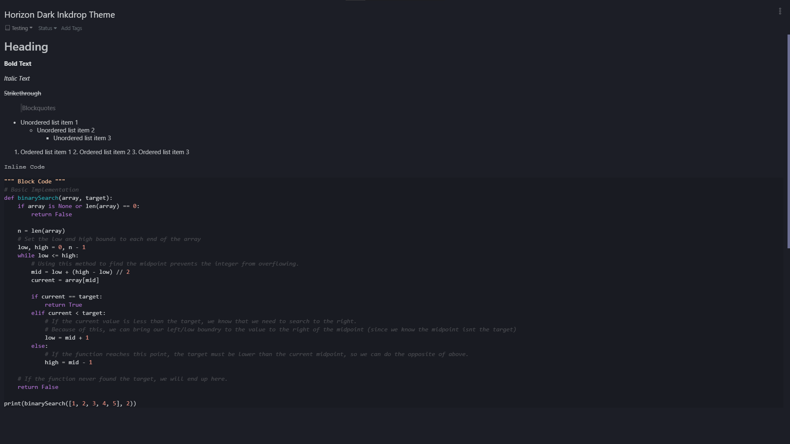

# Horizon Preview Theme

This Horizon preview theme is a port of the original Horizon theme by [Jolaleye](https://github.com/jolaleye) for the [Inkdrop note-taking app](https://www.inkdrop.app/). This particular module modifies the theme for the app's markdown preview panel. For other modules of the theme, check the list below.



## All Horizon Modules
- [Horizon: UI Theme](https://github.com/cdevoogd/inkdrop-horizon-ui-theme)
- [Horizon: Syntax Theme](https://github.com/cdevoogd/inkdrop-horizon-syntax-theme)
- [Horizon: Preview Theme](https://github.com/cdevoogd/inkdrop-horizon-preview-theme)

## Installation

Inside your command line run the following:
```
ipm install horizon-dark-preview
```

To install the additional horizon modules:
```
ipm install horizon-dark-syntax
ipm install horizon-dark-ui
```

## Credits

- [Inkdrop](https://www.inkdrop.app/) for the Inkdrop app.
- [Jolaleye](https://github.com/jolaleye) for the original [Horizon theme](https://horizontheme.netlify.app/).

## License

This project is licensed under the MIT License - see the [LICENSE](LICENSE) file for details